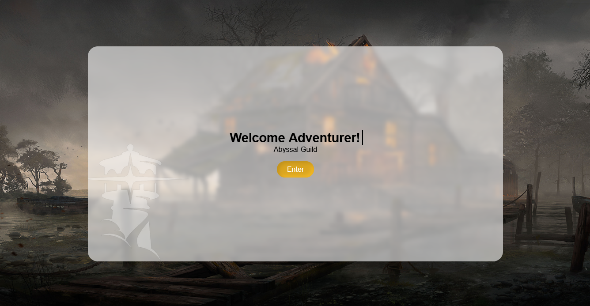

# Abyssal Guild


## Project Notes

**Abyssal Guild** is a student school project focused on creating an MMORPG-themed web design with interactive animations and a fantasy guild atmosphere.

This is a front-end practice project. It is not intended to represent a production game, commercial service, or complete MMORPG system.

## Current Concept

- Fantasy MMORPG and adventurer guild theme
- Animated intro screen with a magic-circle transition
- Interactive homepage with a featured content slider
- Typing-style promotional text
- Navigation pages for FAQs, About, Services, and Contact
- Adventurer registration form and registered adventurer display
- PHP files for basic form and database-related school project practice

## Project Structure

```text
index.html   -> starts the animated entry flow
pages/       -> contains the homepage, information pages, and registration views
scripts/     -> controls navigation, typing, sliders, and animations
styles/      -> contains page-specific CSS
img/         -> contains logos, backgrounds, characters, and other assets
fonts/       -> contains project font files
system/      -> contains PHP database connection and helper files
```

## Technologies Used

- HTML
- CSS
- JavaScript
- PHP
- MySQL or another compatible database setup
- Font Awesome icons via CDN

## Running the Project

1. Open the project through a local PHP server if you want to use the PHP registration features.
2. Open `index.html` to view the animated intro screen.
3. Select **Enter** to continue to the Abyssal Guild homepage.

For PHP functionality, place the project in a local server environment such as XAMPP, WAMP, or PHP's built-in development server. Update the database settings in `system/connection.php` for your local setup.

[View the live demo](https://abyssal-guild.vercel.app)

## Student Project Note

This project is made for learning and school submission purposes. The design, code, assets, and interactions may still change as the project develops.
